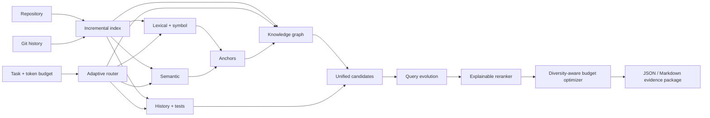

# ContextForge

> ContextForge is an adaptive repository-intelligence and context-engineering platform that combines hybrid retrieval, code knowledge graphs, Git-history memory, and token-budgeted evidence selection to help autonomous coding agents understand large codebases.

[](https://github.com/rustagiaaryan/contextforge/actions/workflows/ci.yml)
[](LICENSE)

Coding agents often spend their context window repeatedly opening plausible but irrelevant files. ContextForge turns a repository, a software task, and a hard token budget into a compact, ranked, explainable evidence package. The package retains source pointers and provenance so an agent can inspect or expand evidence without ingesting the whole repository.

> **Status:** active alpha development. The deterministic local path is designed to work without API keys. Benchmark numbers will only be added after the checked-in evaluation harness has produced them.

## Architecture



The graph supplements high-confidence lexical and semantic anchors; it does not initiate an unbounded repository traversal. See [Architecture](docs/ARCHITECTURE.md) and [Decisions](docs/DECISIONS.md).

## Planned quick start

```bash
uv sync --extra dev
uv run contextforge index ./repository
uv run contextforge compile ./repository \
  --task "Requests through mounted sub-applications lose their route prefix." \
  --token-budget 8000 --format markdown
```

The public Python interface is designed around:

```python
from contextforge import ContextForge

engine = ContextForge.open("./repository")
engine.index()
result = engine.compile_context(task="Fix mounted route prefixes", token_budget=8_000)
print(result.to_markdown())
```

## Documentation

- [Architecture](docs/ARCHITECTURE.md)
- [Implementation plan](docs/PLAN.md)
- [Architecture decisions](docs/DECISIONS.md)
- [Evaluation methodology](docs/EVALUATION.md)
- [Demo guide](docs/DEMO.md)
- [Security model](docs/SECURITY.md)
- [Contributing](CONTRIBUTING.md)

## Limitations and roadmap

Python is the first-class language for the initial release. Calls and references are intentionally best-effort in a dynamic language, and local hash embeddings trade model quality for a zero-download, deterministic baseline. The roadmap tracks richer parsers, learned reranking, cross-encoders, and data-flow slicing after the core pipeline is stable.

## License

MIT

